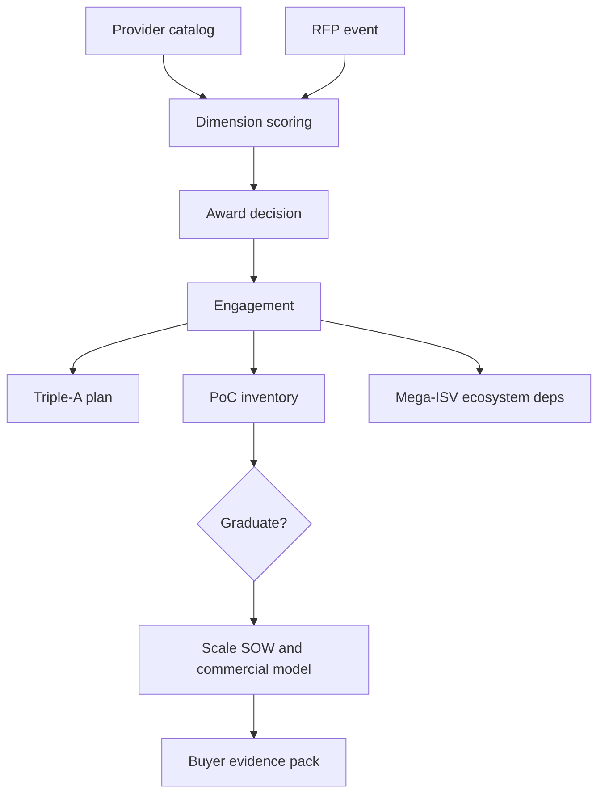

# Selectum

**Source:** `ai-in-enterprise/hfs-blueprint-report-enterprise-artificial-intelligence-ai-services-2018/`
**Domain:** `ai-enterprise`
**One-liner:** An enterprise AI services sourcing workbench that scores providers on orchestration of AI+automation+analytics (the Triple-A trifecta), use-case depth, delivery robustness, and PoC-to-production discipline — so buyers stop mistaking chatbot toe-dips for enterprise AI.
**Wedge:** Enterprise sourcing and intelligent-automation programme leads running an AI services RFP or provider rationalisation across BFSI and other verticals, comparing multi-tower providers the way HfS Blueprint assessed 18 firms (Winner’s Circle including IBM, Accenture, TCS, Deloitte, Cognizant, Genpact).
**Positioning:** Buyer-side AI services evaluation and engagement governance. Distinct from Operum (internal intelligent-ops readiness/investment), Triara (internal AI risk/talent portfolio), Bindora (API integration control plane), and Lexara (technique/claim literacy). Selectum productises the Blueprint lens: AI is not one market but building blocks; enterprise AI is still often bolt-on; industrialization vs project-centric approaches differ; PoCs (especially chatbots) distort progress; holy grail is iterative data inputs with less training friction; mega-ISV ecosystems (Microsoft, Google, AWS, IBM) matter; service providers must be judged on orchestration, process transformation, data strategies, and scale — not slideware.

## Market research synthesis

### Thesis from source

HfS Research’s *Enterprise AI Services 2018 Blueprint* assesses how service providers orchestrate diverse cognitive and AI solutions within service delivery, emphasising business-function/process automation rather than isolated task bots. RPA-only discussions are out of scope unless broad AI is integrated. The **Triple-A Trifecta** — AI intersecting Automation and Analytics — is nonlinear: enterprises can start anywhere, but must understand the business problem and apply the relevant value levers. Building blocks include NLP, machine/deep learning, neural networks, virtual agents, autonomics, computer vision, and more.

Executive findings that become product requirements: enterprise AI services grow >100% annually from a low base (HfS cites ~$1.6B for RPA extension through AI in 2018 alone) but sizing “the” AI market is misleading; AI is not plug-and-play; deployments are often peripheral bolt-ons; approaches duplex into industrialization vs project-centric work; the market is awash in PoCs around RPA extension, autonomics, and conversational services, with commercial implications of scale still poorly understood; chatbot hype creates risk-free toe-dips that rarely take customer interaction through to execution; value concentrates where data-centric mindsets reduce training time on semi/unstructured data; BFSI leads but all verticals adopt; mega-ISVs form the gravity well for ecosystems; HfS assessed 18 providers on execution and innovation, with Winner’s Circle differentiation on variety, depth, and scale of use cases plus delivery robustness.

Selectum turns Blueprint-style dimensions into a living RFP and engagement scorecard: orchestration capability, use-case portfolio depth, data/AI engineering talent model, PoC graduation rate, ecosystem alignment to mega-ISVs, commercial model readiness for scale, and transformation evidence — with buyer evidence packs instead of analyst PDFs alone.

### Buyer & economic model

- **Primary buyer:** CPO / Head of Sourcing for IT & Business Services, jointly with Intelligent Automation programme owner.
- **Users:** RFP managers; IA/AI architects; LOB process owners; vendor managers; commercial/legal; finance (TCO).
- **Budget owner / value metric:** Services and transformation budget. Value metric is *PoC-to-production graduation rate* and *cost per scaled use case* under selected providers — not number of chatbot pilots.
- **Competing status quo:** Analyst quadrants saved as PDFs; generic RFP score sheets; vendor-led PoC farms; separate RPA and analytics contracts with no orchestration clause.

### Domain constraints

- **Regulatory / trust / safety:** BFSI and other regulated buyers need auditability of model-assisted processes; cross-border delivery and data residency constrain provider choices.
- **Data sensitivity:** Provider access to semi/unstructured enterprise data requires strict processing terms; scorecards comparing incumbents are politically sensitive.
- **Change-management realities:** Business units love demos; providers optimise for logo PoCs; mega-ISV lock-in fears collide with the reality that ecosystems concentrate there.

## Business requirements

- BR-1: Every sourcing event scores providers on Blueprint-like dimensions: orchestration, use-case depth/scale, delivery robustness, innovation, data/AI engineering, commercial scale readiness.
- BR-2: Engagements declare Triple-A starting lever (AI, automation, analytics) and target intersection outcomes.
- BR-3: Chatbot/conversational PoCs must define execution completion criteria (handoff to fulfilled process), not demo scripts alone.
- BR-4: Bolt-on vs architecture-impact intents are labelled; bolt-ons cannot be reported as enterprise transformation.
- BR-5: Industrialized offering reuse vs project-centric build is recorded for TCO honesty.
- BR-6: Mega-ISV ecosystem dependencies (Microsoft, Google, AWS, IBM, etc.) are declared per solution.
- BR-7: PoC inventory tracks age, cost, and graduation/abandon reasons; aged PoCs auto-escalate.
- BR-8: Data-centric readiness (iterative inputs, training-time targets, semi/unstructured sources) is scored before scale SOW.
- BR-9: Vertical use-case evidence (e.g. AML thresholding, multi-channel sentiment) must cite transferable assets, not logos.
- BR-10: Commercial models must address scale economics before enterprise rollout approval.
- BR-11: Buyer evidence packs reconcile scored RFPs, selected providers, and production outcomes annually.
- BR-12: Audit trail retains score methodologies and evaluator identities for contested awards.

## User stories

Canonical user stories live in sibling [USER_STORIES.md](USER_STORIES.md).

## System design

### Overview

Selectum runs provider catalogs, scoring dimensions, RFP events, engagement records (Triple-A, PoCs, ecosystems, commercial models), graduation tracking, and buyer evidence packs. It is a sourcing+programme control plane, not an ML runtime.

### Actors & boundaries

- **Actors:** Sourcing, IA programme, architects, process owners, commercial, evaluators, providers (limited portal).
- **Trust boundary:** Score sheets and evaluator notes restricted; providers see only their RFP workspace.
- **Human-in-the-loop points:** Dimension weights, award decisions, PoC abandon classification, scale SOW approval.

### Core capabilities

1. Provider catalog and evidence
2. Blueprint dimension scoring
3. RFP event management
4. Triple-A engagement design
5. PoC inventory and graduation
6. Ecosystem dependency register
7. Data-centric readiness checks
8. Commercial scale modelling
9. Buyer evidence packs
10. Award audit governance

### Conceptual data

- **Primary entities:** ServiceProvider, ScoreDimension, ProviderScore, RfpEvent, Engagement, TrifectaPlan, PocRecord, EcosystemDependency, ReadinessCheck, CommercialModel, EvidencePack, AuditEntry.
- **Critical events:** RFP opened; scores submitted; PoC aged out; graduated to production; scale SOW approved; evidence pack issued.
- **Retention / audit needs:** Scores, awards, and methodology versions retained for procurement challenge windows.

### Integrations (conceptual)

- **Systems of record:** Procurement/CLM; IA programme tools; ITSM; data platform inventories; mega-ISV billing.
- **Upstream signals:** PoC status, production KPIs, invoice actuals.
- **Downstream actions:** Award notices, SOW gates, provider exit plans, annual evidence packs.

### High-level architecture

### Success metrics

- **Leading:** PoC age distribution; % engagements with execution-complete conversational criteria; readiness pass rate before scale.
- **Lagging:** PoC-to-production rate; cost per scaled use case; bolt-on share misreported as transformation (should fall).

## OpenAPI skeleton

Canonical HTTP surface lives in sibling `openapi.yaml`. Summarize here:

- **Base path:** `/v1/...`
- **Auth:** `ApiKeyAuth` for procurement/IA integrations; `BearerAuth` for sourcing, architects, evaluators.
- **Resource groups:** Providers, Scoring, RFPs, Engagements, PoCs, Ecosystems, Commercial, Governance.
