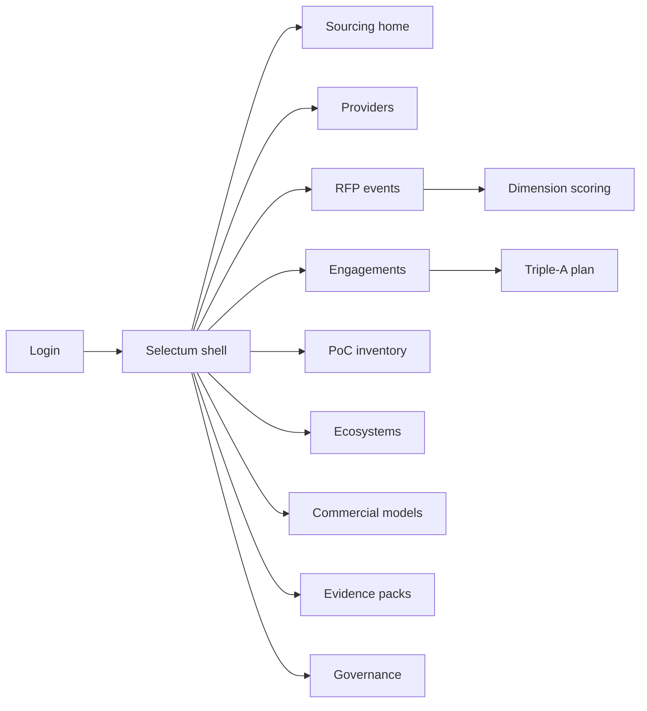
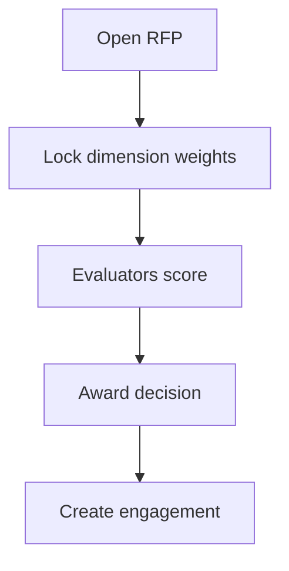

# Selectum — Web app

**Product:** [PRODUCT.md](./PRODUCT.md)
**Primary surface:** AI services sourcing workbench (CPO / IA programme shell)
**Secondary surfaces:** Limited provider RFP response portal; annual buyer evidence pack viewer
**Design thesis:** Selectum is a procurement floor for enterprise AI services — not a chatbot sandbox. The UI metaphor is a Blueprint scoreboard: providers compete on orchestration of the Triple-A trifecta (AI × Automation × Analytics), use-case depth, and PoC-to-production discipline. Visual language is charcoal and brass on cool stone panels — award decisions feel formal; aged PoCs pulse amber until they graduate or die. Chatbot demos never get a green “transformed” badge without execution-completion criteria.

## UX research synthesis

### Category peers (best-in-class)

- **Coupa / SAP Ariba sourcing events:** Structured RFP scoring with evaluator audit trails. Steal: dimension-weighted score sheets and contested-award lineage; reject generic goods-RFx field sets that ignore Triple-A.
- **HfS Blueprint / Gartner Magic Quadrant consumption UIs (buyer overlays):** Peer comparison on execution × innovation. Steal: Winner’s Circle-style axes made editable with buyer evidence, not PDF wallpaper; reject treating analyst placement as immutable truth.
- **ServiceNow Vendor Manager Workspace:** Engagement lifecycle and risk. Steal: PoC inventory age escalation and production outcome link-back; reject ITSM ticket chrome as the sourcing home.
- **Icertis / Ironclad CLM patterns:** Commercial terms as governed objects. Steal: scale economics and industrialized-vs-project flags before SOW approve; reject burying commercial model in email attachments.

### Patterns to adopt / reject

- **Adopt:** Blueprint dimension scoring; Triple-A engagement plans; conversational execution-completion criteria; bolt-on vs transformative labels; PoC age escalation; mega-ISV dependency register; data-centric readiness before scale; buyer evidence packs; evaluator identity audit.
- **Reject:** Logo walls as proof; chatbot PoC farms as progress KPIs; RPA-only scorecards marketed as AI; purple “AI partner” marketing themes; editable award totals after lock; provider self-score as sole input.

### Trust, density, and workflow constraints from PRODUCT.md

Scorecards comparing incumbents are politically sensitive — role-gated columns (domain constraints). Awards need methodology + evaluator identity retained (BR-12). Aged PoCs auto-escalate (BR-7). Bolt-ons cannot report as transformation (BR-4). Scale SOWs require commercial scale readiness and data-centric checks (BR-8, BR-10). Providers see only their RFP workspace (trust boundary).

## Information architecture

### Nav model

### Roles → default home

| Role | Default home | Why |
|------|--------------|-----|
| Head of Sourcing / CPO | Sourcing home — RFP + PoC age | Stop toe-dip culture (BR-7) |
| IA programme owner | Engagements — Triple-A | Orchestration across contracts (BR-2) |
| Process owner | Engagement / PoC detail | Execution completion for conversational (BR-3) |
| Architect | Ecosystems + readiness | Mega-ISV and data-centric gates (BR-6, BR-8) |
| Commercial / finance | Commercial models | Cost per scaled use case (BR-5, BR-10) |
| Evaluator | Active RFP scoring | Dimension scores with identity (BR-1, BR-12) |
| Provider (limited) | Assigned RFP workspace | Evidence upload only |

### Cross-links to OpenAPI resources

| Nav area | OpenAPI tags / resources |
|----------|---------------------------|
| Providers | Providers |
| Dimension scoring | Scoring |
| RFP events | RFPs |
| Engagements / Triple-A | Engagements |
| PoC inventory | PoCs |
| Mega-ISV deps | Ecosystems |
| Scale commercial | Commercial |
| Evidence / audit | Governance |

## Screen inventory

### Sourcing home

- **Purpose:** Answer “are we industrializing AI services or farming PoCs?” in one composition.
- **Entry:** Default for sourcing / IA leads.
- **Layout regions:** Brand + period; PoC age histogram; graduation rate; open RFPs; bolt-on vs transformative mix; escalations rail.
- **Primary actions:** Open RFP; escalate aged PoC; open evidence pack.
- **Empty / loading / error:** Empty = start first RFP or import provider catalog; loading = skeleton; error = retry with request id.
- **BR / story ties:** BR-7; sourcing stories.

### Provider catalog

- **Purpose:** Living catalog with Blueprint-like evidence — variety, depth, scale — not logo slides.
- **Entry:** Nav → Providers.
- **Layout regions:** Provider table; dimension summary; vertical assets; ecosystem badges; link to past scores.
- **Primary actions:** Add provider; attach evidence; open score history.
- **Empty / loading / error:** Empty = seed from known mega-ISV ecosystems.
- **BR / story ties:** BR-1, BR-9.

### RFP event workspace

- **Purpose:** Run a scored sourcing event with locked methodology.
- **Entry:** Nav → RFPs; create from home.
- **Layout regions:** Event header; invited providers; dimension weights; evaluator assignments; status (draft/scoring/awarded).
- **Primary actions:** Invite; lock weights; submit scores; award; export challenge pack.
- **Empty / loading / error:** No evaluators = cannot open scoring; unlocked weights warning.
- **BR / story ties:** BR-1, BR-12.

### Dimension scoring

- **Purpose:** Score orchestration, use-case depth/scale, delivery robustness, innovation, data/AI engineering, commercial scale readiness.
- **Entry:** RFP → Scoring.
- **Layout regions:** Score grid (provider × dimension); evidence pane; comments; evaluator stamp.
- **Primary actions:** Save score; attach evidence; finalize evaluator sheet.
- **Empty / loading / error:** Missing evidence on high score = amber validation.
- **BR / story ties:** BR-1, BR-9.

### Engagement workspace

- **Purpose:** Post-award operating record: Triple-A plan, bolt-on vs transformative, PoCs, ecosystems, commercial path.
- **Entry:** Nav → Engagements; from award.
- **Layout regions:** Trifecta starting lever + intersection targets; intent label (bolt-on vs architecture-impact); linked PoCs; readiness; scale gate.
- **Primary actions:** Update Triple-A; open PoC; request scale SOW.
- **Empty / loading / error:** Missing Triple-A = incomplete banner.
- **BR / story ties:** BR-2, BR-4.

### Triple-A plan editor

- **Purpose:** Declare AI / Automation / Analytics starting lever and target intersections.
- **Entry:** Engagement → Triple-A.
- **Layout regions:** Lever picker; intersection outcome fields; contract linkage warnings when levers live in separate vendors without orchestration clause.
- **Primary actions:** Save plan; flag missing orchestration clause.
- **Empty / loading / error:** None selected = block.
- **BR / story ties:** BR-2.

### PoC inventory

- **Purpose:** Track age, cost, graduation/abandon — auto-escalate aged toe-dips.
- **Entry:** Nav → PoCs; home escalations.
- **Layout regions:** PoC table with age clock; conversational execution-completion criteria column; graduate/abandon actions; cost.
- **Primary actions:** Graduate; abandon with reason; escalate; define execution completion for bots.
- **Empty / loading / error:** Aged without action = coral escalate state.
- **BR / story ties:** BR-3, BR-7.

### Ecosystem dependencies

- **Purpose:** Conscious mega-ISV gravity (Microsoft, Google, AWS, IBM, etc.).
- **Entry:** Nav → Ecosystems; engagement detail.
- **Layout regions:** Dependency register per solution; concentration heat; lock-in notes.
- **Primary actions:** Declare dependency; compare alternatives.
- **Empty / loading / error:** Undeclared on scale path = warning.
- **BR / story ties:** BR-6.

### Data-centric readiness

- **Purpose:** Score iterative inputs, training-time targets, semi/unstructured sources before scale SOW.
- **Entry:** Engagement → Readiness; scale CTA.
- **Layout regions:** Readiness checklist/scores; blockers; remediation owners.
- **Primary actions:** Submit check; clear for scale.
- **Empty / loading / error:** Fail = scale SOW blocked (BR-8).
- **BR / story ties:** BR-8.

### Commercial scale models

- **Purpose:** Industrialized reuse vs project-centric TCO; scale economics before rollout.
- **Entry:** Nav → Commercial; scale approval flow.
- **Layout regions:** Model type flag; unit economics (cost per scaled use case); take-rate/volume assumptions; approve/deny.
- **Primary actions:** Submit model; approve scale; link invoices later.
- **Empty / loading / error:** Missing model = cannot approve enterprise rollout (BR-10).
- **BR / story ties:** BR-5, BR-10.

### Buyer evidence packs

- **Purpose:** Annual reconciliation of scored RFPs, selected providers, and production outcomes.
- **Entry:** Nav → Evidence packs.
- **Layout regions:** Pack builder; RFP/score slices; graduation outcomes; export.
- **Primary actions:** Generate; publish; share with audit.
- **Empty / loading / error:** Incomplete outcomes = pack draft only.
- **BR / story ties:** BR-11.

### Governance / award audit

- **Purpose:** Methodology versions, evaluator identities, contested award trail.
- **Entry:** Nav → Governance.
- **Layout regions:** Methodology list; evaluator log; challenge window status.
- **Primary actions:** Freeze methodology; export audit.
- **Empty / loading / error:** Post-lock edit blocked.
- **BR / story ties:** BR-12.

### Provider RFP portal (secondary)

- **Purpose:** Limited workspace for invited providers to upload evidence — no peer scores.
- **Entry:** Provider login / invite link.
- **Layout regions:** RFP requirements; upload; Q&A; submission status.
- **Primary actions:** Upload evidence; submit; withdraw.
- **Empty / loading / error:** Closed RFP = read-only.
- **BR / story ties:** Trust boundary; BR-1.

## Key flows

1. **Run Blueprint-style RFP** — define dimensions/weights → invite → score with evidence → award → open engagement; failure: unlocked methodology or missing evaluator identity.

2. **PoC graduate or kill** — register PoC → age clock → execution criteria (if conversational) → graduate or abandon; aged auto-escalate (BR-3, BR-7).

3. **Scale SOW gate** — readiness pass → commercial scale model → mega-ISV deps declared → approve; failure blocks rollout (BR-8, BR-10).

4. **Triple-A engagement design** — pick starting lever → set intersection outcomes → flag split contracts without orchestration (BR-2).

5. **Annual evidence pack** — pull scores + outcomes → publish buyer pack (BR-11).

## Design system

### Tokens (CSS variables)

- `--color-ink: #1C1A17` — primary text
- `--color-stone: #F3F0EA` — app ground
- `--color-panel: #FFFcf8` — panels
- `--color-rule: #D2CBC0` — dividers
- `--color-brass: #A67C2D` — awards / formal confirms
- `--color-charcoal: #2E3438` — chrome
- `--color-amber: #D4891A` — aged PoC
- `--color-coral: #C4574A` — escalate / block scale
- `--color-teal: #2F6F68` — graduated to production
- `--color-brand: #A67C2D` — Selectum wordmark
- `--font-display: "Libre Franklin", sans-serif` — sourcing titles
- `--font-body: "Source Sans 3", sans-serif` — dense score grids
- `--font-mono: "Source Code Pro", monospace` — RFP ids, evaluator stamps
- `--space-1`…`--space-8`: 4px scale
- `--radius-sm: 3px`; `--radius-md: 6px` — procurement-sharp
- `--motion-escalate: 240ms ease-in-out` — PoC age pulse
- `--motion-award: 200ms ease-out` — award lock flash
- `--motion-score: 160ms ease-out` — score cell commit
- Atmosphere: subtle stone texture; brass rule under awards; no chatbot mascot art.

### Typography & brand

- Franklin display for event and provider names; Source Sans for matrices; mono for audit stamps.
- Brand in shell on every scored view; login: brand + “Score AI services on orchestration, not demos” + one CTA.

### Do / don’t

- **Do:** Lock weights before scoring; require execution completion for conversational PoCs; label bolt-ons; escalate aged PoCs; retain evaluator identity.
- **Don’t:** Purple AI partner glow; logo proof walls; green “transformed” without architecture-impact intent; hide peer provider scores from unauthorized roles; emoji award badges.

### Accessibility & domain trust cues

- Score states use numeric + text, not colour alone.
- Live regions for PoC escalation and award lock.
- Provider portal never exposes competitor scores.
- Focus order follows RFP → score → award → engagement → scale.

## Component patterns

- **BlueprintScoreGrid** — provider × dimension with evidence affordance.
- **TrifectaPlanMap** — AI/Automation/Analytics lever and intersections.
- **PocAgeEscalator** — age clock with graduate/abandon.
- **ExecutionCompletionCriteria** — conversational fulfilment definition.
- **BoltOnVsTransformLabel** — intent badge that blocks over-claim.
- **MegaIsvDependencyChip** — ecosystem gravity markers.
- **DataCentricReadinessGate** — pre-scale checklist.
- **CommercialScaleCard** — industrialized vs project-centric TCO (interaction container).
- **BuyerEvidencePack** — annual reconciliation export.
- **EvaluatorStamp** — identity + methodology version on scores.

## Out of scope for v1 web

- Running models or RPA bots; full CLM authoring beyond scale flags; public analyst-report redistribution; multi-buyer marketplace; native mobile evaluator apps beyond score entry; provider marketing CMS.
